<h1 align='center'>🌟 Página para aprender Braille 📖🧑‍🦯♿️🌟</h1>

> Practica de React, Tailwind y TypeScript. ✨

🎯 Objetivo: Ofrecer una introducción accesible y comprensible al sistema de lectura táctil Braille, permitiendo que aquellos que pueden ver adquieran conocimientos sobre este valioso método de comunicación. A través de recursos educativos y prácticos, esta página brinda la oportunidad de explorar y comprender el Braille, fomentando así la inclusión de las personas ciegas.

------------

### Instalación y ejecución del proyecto (React) 🛠️💻

1. Abre la consola en la ubicación deseada para clonar el repositorio.

2. Clona este repositorio en tu máquina local utilizando Git:

    ```bash
    git clone https://github.com/Schugu/BraillePage.git
    ```

3. Navega al directorio del proyecto clonado:

    ```bash
    cd BraillePage
    ```

4. Instala las dependencias del front end utilizando npm o yarn:

    ```bash
    npm install
    # o
    yarn
    ```

5. Inicia el servidor de desarrollo del proyecto utilizando npm:

    ```bash
    npm run dev
    ```

6. Una vez que el servidor de desarrollo del proyecto esté en funcionamiento, abre tu navegador web y navega a la dirección local para ver el proyecto en acción.

### Personalización y comprensión del proyecto 🎨🧠

Para personalizar y comprender el proyecto, sigue estas instrucciones:

- Si deseas modificar o entender cómo funciona el proyecto, revisa los archivos y carpetas dentro de `src`. 
    - La lógica y la apariencia de las páginas se encuentran en la carpeta `pages`.
    - Los componentes individuales se encuentran en la carpeta `components`.
    - El sistema de rutas se encuentra en el archivo `App.tsx`.

------------

### Utilidades 📦

#### 📌 Teclado Braille a texto 
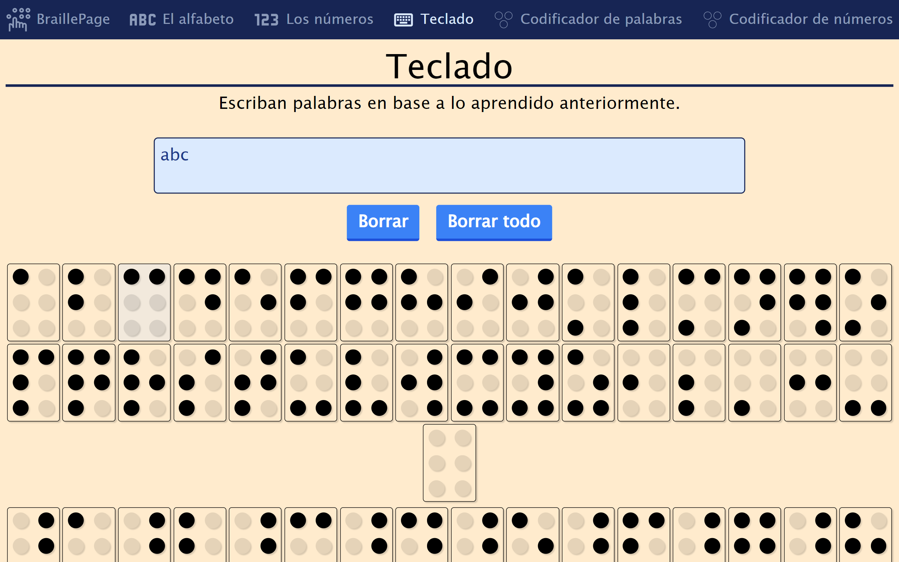

#### 📌 Codificador de texto a Braille
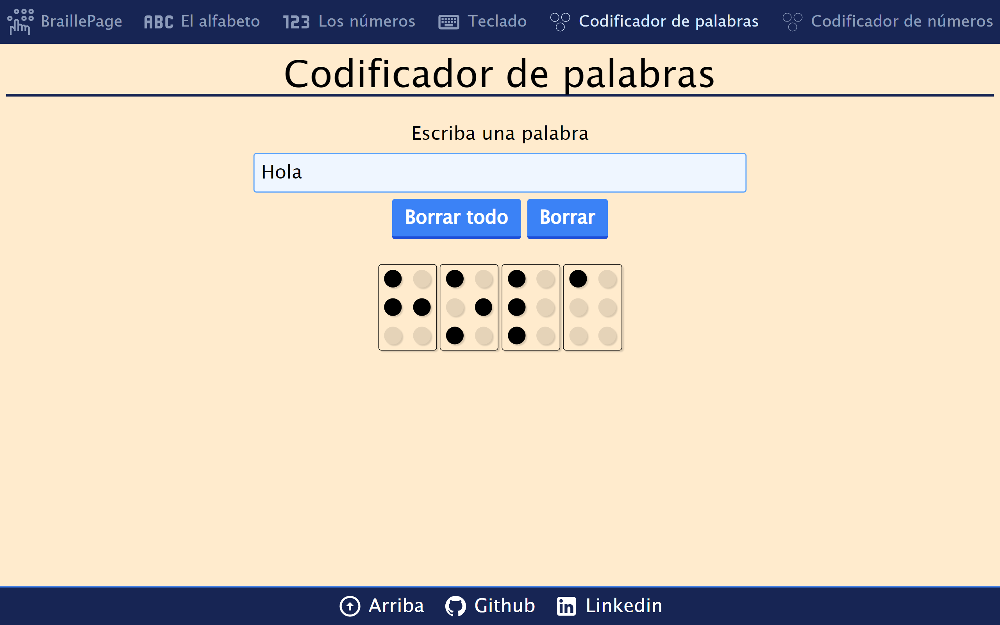

#### 📌 Codificador de número a Braille
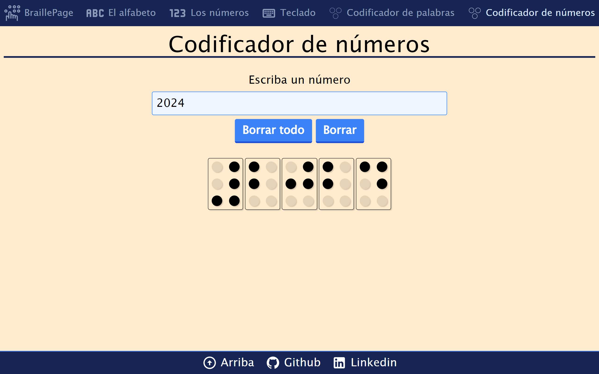

------------

## Capturas de pantalla 📸
### 📱 Celular 📱
<table width="100%">
  <tr>
    <td width="50%">
      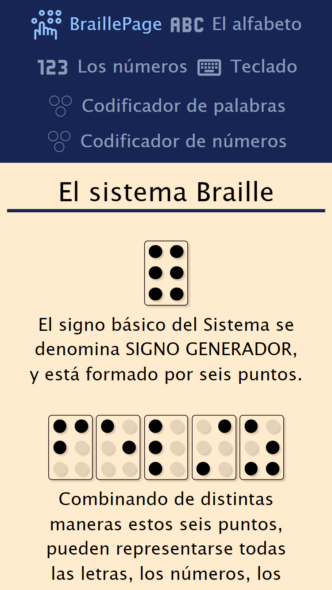
    </td>
    <td width="50%">
        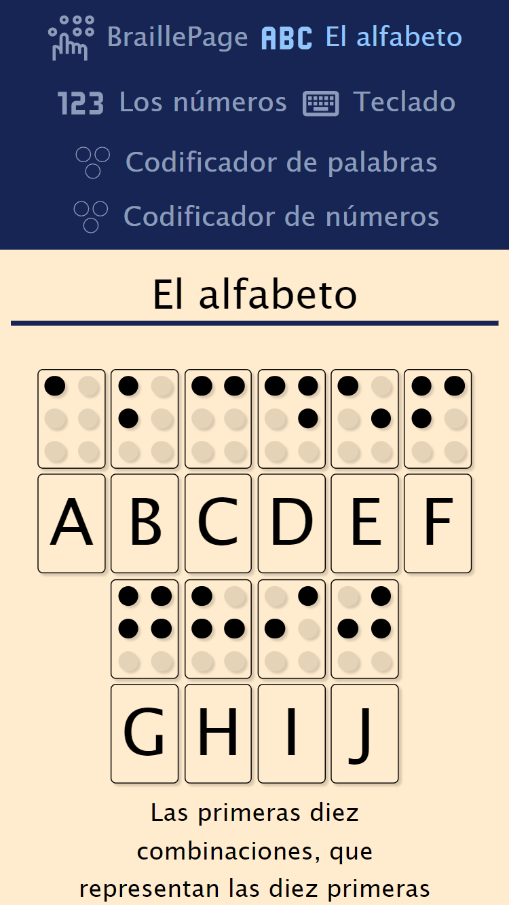
    </td>
  </tr>
  <tr>
    <td width="50%">
      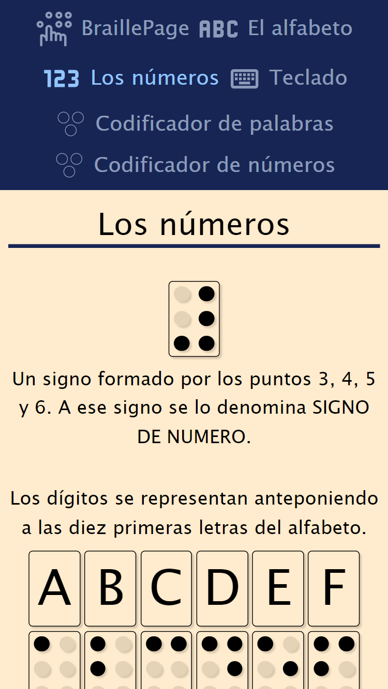
    </td>
    <td width="50%">
        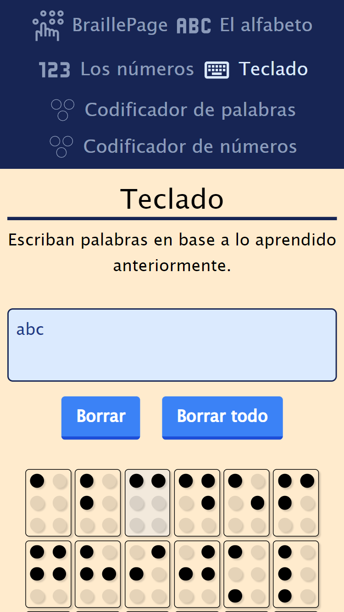
    </td>
  </tr>
  <tr>
    <td width="50%">
      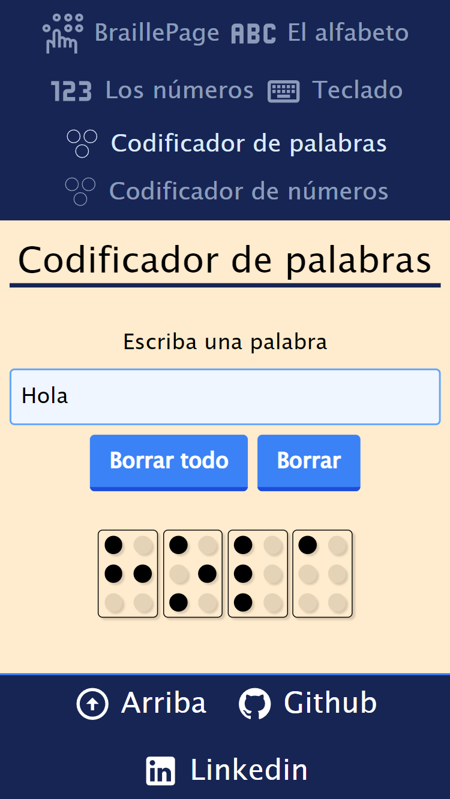
    </td>
    <td width="50%">
        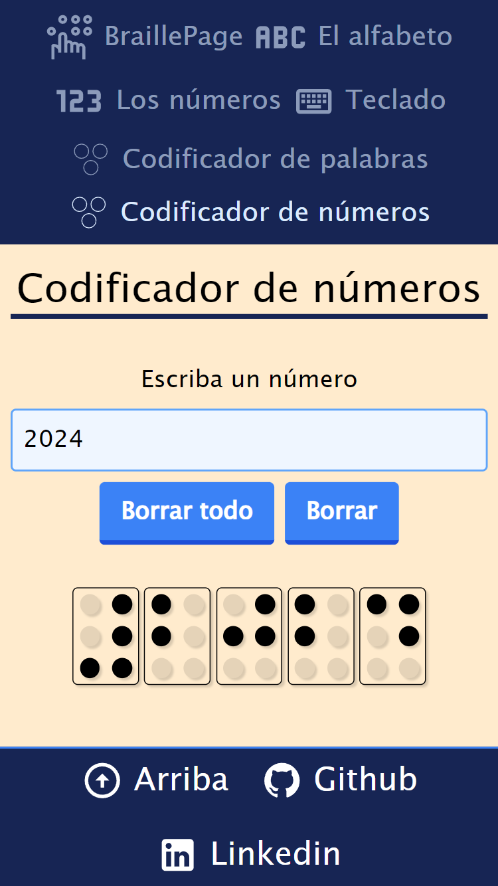
    </td>
  </tr>
 
</table>

### 💻 Computadora 💻
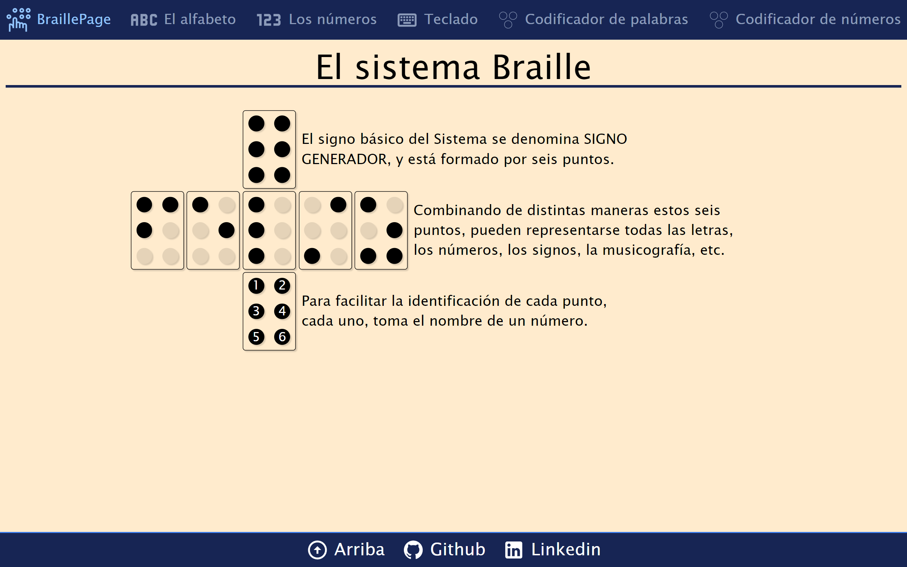
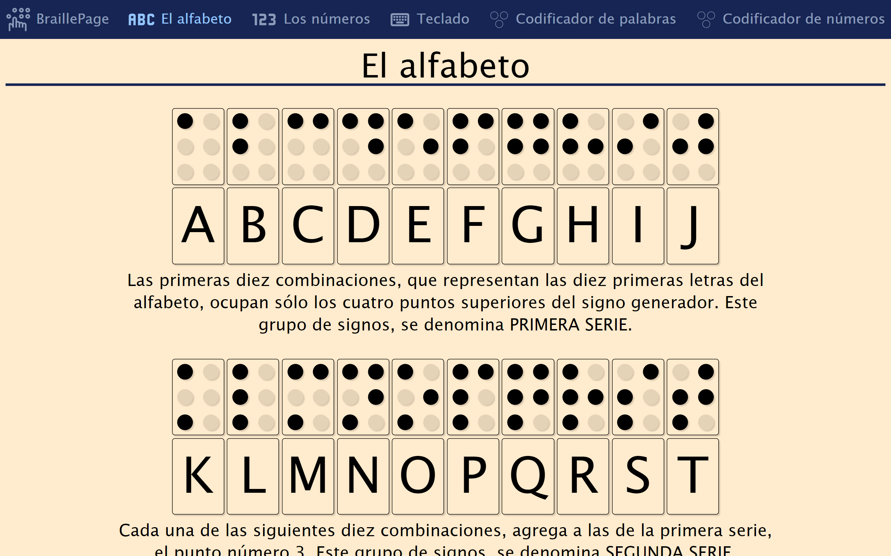
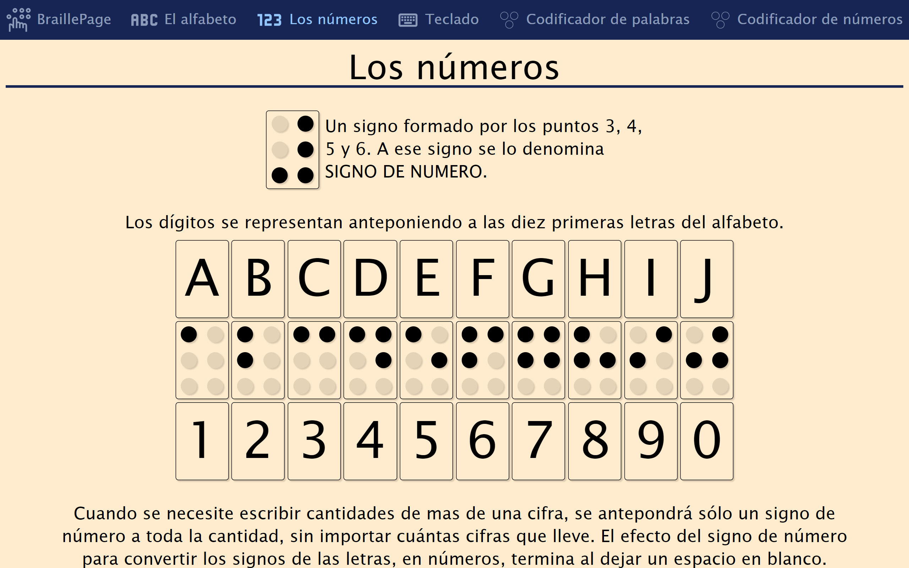


