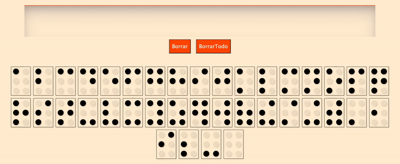
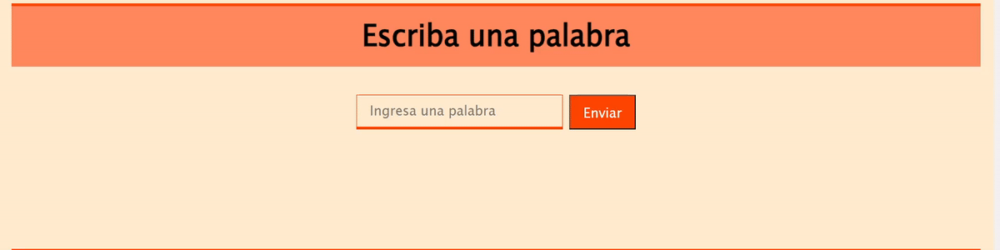
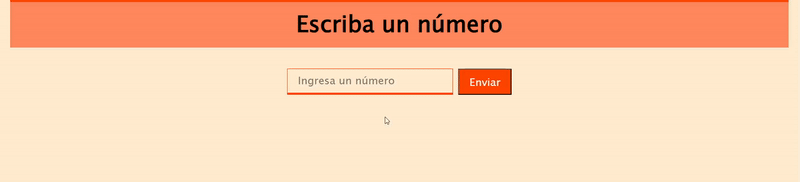
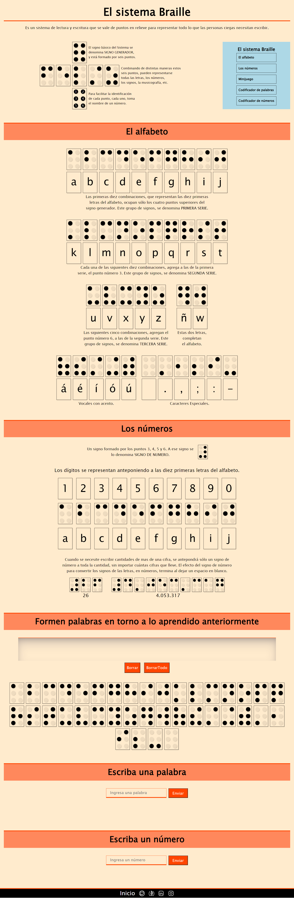

<h1 align='center'>🌟 Página para aprender Braille 📖🧑‍🦯♿️🌟</h1>

🎯 Objetivo: Ofrecer una introducción accesible y comprensible al sistema de lectura táctil Braille, permitiendo que aquellos que pueden ver adquieran conocimientos sobre este valioso método de comunicación. A través de recursos educativos y prácticos, esta página brinda la oportunidad de explorar y comprender el Braille, fomentando así la inclusión de las personas ciegas.

------------

### Instalación 🛠️💻

Sigue estos pasos para clonar y ejecutar el proyecto localmente:

1. Clona este repositorio en tu máquina local utilizando Git:

    ```bash
    git clone https://github.com/Schugu/BraillePage.git
    ```

2. Navega al directorio del proyecto:

    ```bash
    cd BraillePage
    ```

3. Una vez clonado el repositorio en tu máquina local, abre el archivo `index.html` en tu navegador web para ver el proyecto.

4. Si deseas personalizar los estilos de la página, puedes hacerlo modificando el archivo `styles.css`. Este archivo contiene todas las reglas de estilo que se aplican a la página. Abre el archivo `styles.css` en un editor de texto o IDE de tu elección, realiza los cambios que desees y guarda el archivo. Luego, recarga la página en tu navegador para ver los cambios aplicados.

5. Si deseas modificar las utilidades y ver el sistema de codificación de caracteres a Braille, puedes revisar los archivos JavaScript en el repositorio.

------------

### Utilidades 📦

#### 📌 Teclado Braille a texto 


#### 📌 Codificador de texto a Braille


#### 📌 Codificador de número a Braille


------------

### Capturas de pantalla 📸

